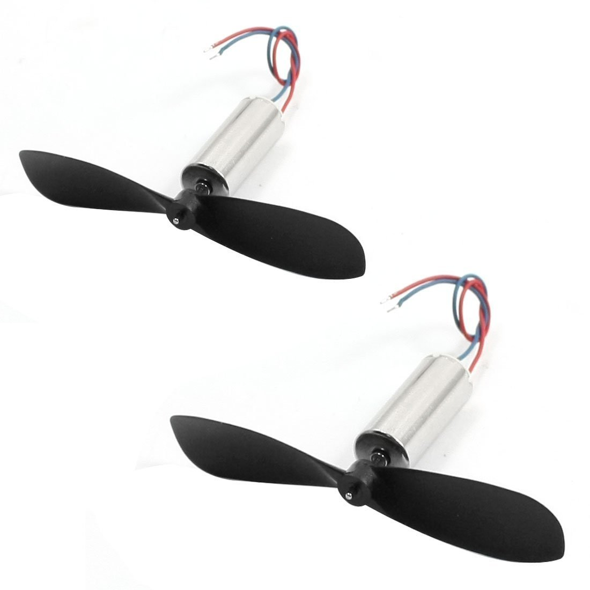
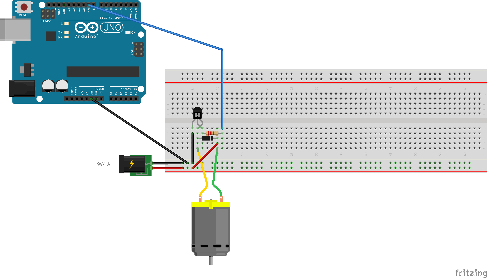

### Fans/ DC Motors
For the Sandstorm Box project, I need 4 fans to blow the sand in the bottom of the box, simulating a sendstorm inside of the box.
For that purpose, I am using these DC 3.7V 40000RPM 100mA Motors with Helicopter Propellers. 

This diagram only shows the wiring for one dc motor but for this project four motors will be connected, each one with a PN2222 
Transistor,a 1N4001 diode and a 270 Ω Resistor, same way as the one shown in the diagram.

### Works with the Sensor
A passive PIR motion sensor changes its state from LOW to HIGH everytime the sensor detects motion. Once the HIGH state signal is
sent, the motors are activated and the motors will stay on until the sensor changes its state to LOW, that is, when the sensor no 
longer captures motion.

### Code

int motorsArray[] = {5, 6, 9, 10};           // Motors array for PWM 5,6,9 and 10
int numOfMotorss = 4;                       // Motor's of index 0-3
int pirState = LOW;
int pirVal = 0;
int pirPin = 12;

void setup()  {
 
  Serial.begin(9600);
  pinMode(pirPin, INPUT);
 
  int i;
  for(i = 0; i < numOfMotors; i++) {
    pinMode(motorsArray[i], OUTPUT);
  }
}

void loop()  {
  pirVal = digitalRead(pirPin);
  int i;
  //if motion is captured, start the motor's subroutine
  if (pirVal == HIGH) {
  for (i= 0; i < numOfMotors; i++) {
    analogWrite(motorsArray[i], 255);
    delay (1000);
  }
  delay (1000);
   for (i= 0; i < numOfMotors; i++) {
    analogWrite(motorsArray[i], 0);
    delay (1000);
  }
  if (pirState == LOW) {
      pirState = HIGH;
    }
  }
  //else, set all motors' values to zero
  else {
    analogWrite(motorsArray[0], 0);
    analogWrite(motorsArray[1], 0);
    analogWrite(motorsArray[2], 0);
    analogWrite(motorsArray[3], 0);
    if (pirState == HIGH) {
      pirState = LOW;
  }
}
}

Using Arduino analog outputs (PWM), it's possible to control the speed of each motor by sending a
number between 0 and 255.

