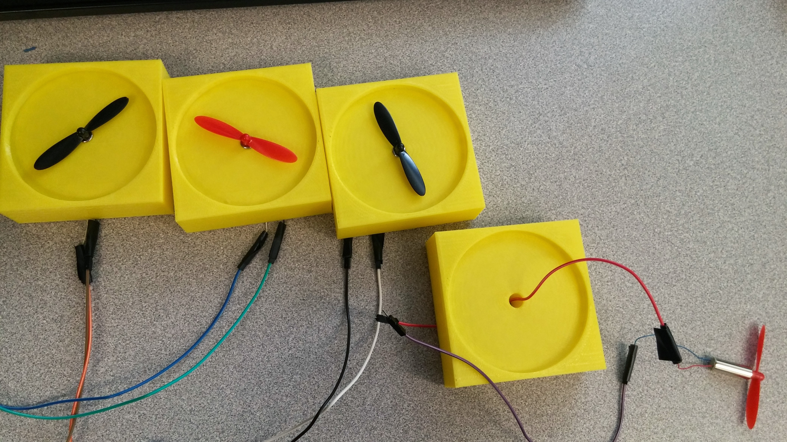
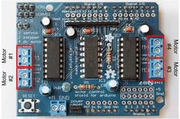

### Sandstorm Box: Project Documentation

#### Design
The first design was a single box with a false top separating the hardware from the "stage" where the sand is blown.


I ended up laser cutting two boxes and stacking one on top of the other. 


The bottom of the top box and the top of the bottom box have 4 holes on the corners and the motors with blades are positioned directly on top of these holes so air is blown downwards.
To hold the motors in place, I 3d printed 4 cubes that fit the motors and blades.

<iframe width="560" height="315" src="https://www.youtube.com/embed/Bgkv-HUuV8s" frameborder="0" allowfullscreen></iframe>



#### Hardware:
I decided to use an Adafruit motor shield to control the 4 DC motors.




#### Code:
```
#include <AFMotor.h>

AF_DCMotor Motor1(1);
AF_DCMotor Motor2(2);
AF_DCMotor Motor3(3);
AF_DCMotor Motor4(4);


int pirState = LOW;
int pirVal = 0;
int pirPin = 12;

void setup() {
   
  Serial.begin(9600);
  pinMode(pirPin, INPUT);
  
}

void loop() {
  pirVal = digitalRead(pirPin);

  //if motion is captured, start the motors
  if (pirVal == HIGH) {
    Motor1.setSpeed(255);
    Motor2.setSpeed(255);
    Motor3.setSpeed(255);
    Motor4.setSpeed(255);
    Motor1.run(FORWARD);
    Motor2.run(FORWARD);
    Motor3.run(FORWARD);
    Motor4.run(FORWARD);
    delay(2000);
  }
}
```

#### Future Implementations

The PIR sensor motion does not work so great for this project. It captures peripheral motion so sometimes it is triggered by any motion around the box. And requires the user to keep moving the hand inside of the box. It would be better to use a distance sensor like the ultrasonic HCSR04. This sensor is triggered by presence of an object at a distance stipulated. This type of sensor would really improve responsiveness. 

The DC 3.7V 40000RPM Motors with Helicopter Propellers blow some air but not enough to actually move a lot of sand oround. Computer cooler fans might be a resonable alternative.


