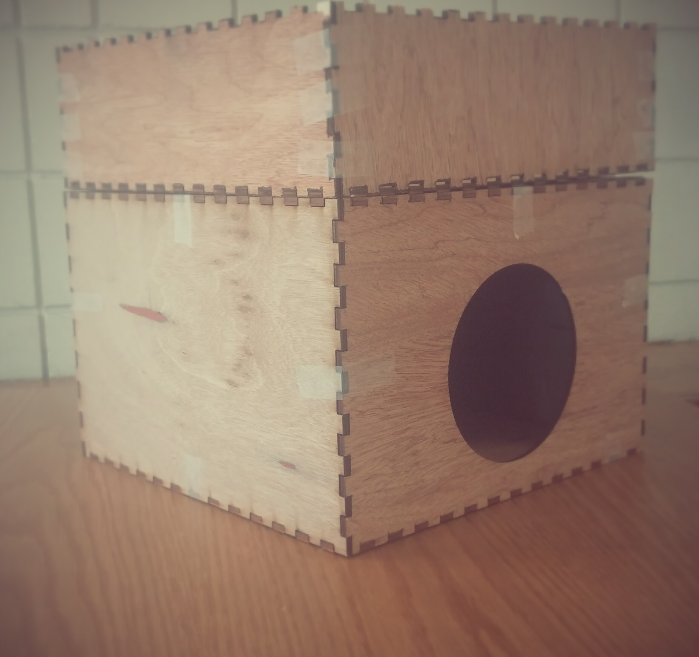

### Sandstorm Box: Project Documentation

#### Design
The first design was a single box with a false top separating the hardware from the "stage" where the sand is blown.

I ended up laser cutting two boxes and stacking one on top of the other. 

The bottom of the top box and the top of the bottom box have 4 holes on the corners and the motors with blades are positioned directly on top of these holes so air is blown downwards.
To hold the motors in place, I 3d printed 4 cubes that fit the motors and blades.

<iframe width="560" height="315" src="https://www.youtube.com/embed/Bgkv-HUuV8s" frameborder="0" allowfullscreen></iframe>

#### Code:

